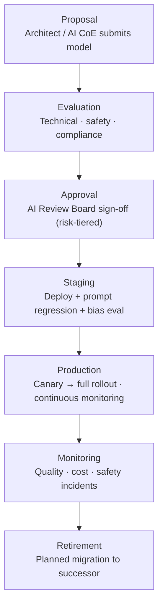

# AI Model Governance Framework — AI Evolution & Maturity Platform

## 1. Purpose

This framework defines how AI models (LLMs, embedding models, evaluation models) are selected, validated, deployed, monitored, and retired within the enterprise. It ensures responsible, transparent, and auditable AI operations across all maturity levels.

---

## 2. Model Lifecycle



---

## 3. Model Card Template

Every model used in production must have a completed Model Card. Stored in `docs/model-cards/`.

```markdown
# Model Card: {model_name}

## Model Details
- Model ID: {provider/model-id}
- Provider: {Anthropic / OpenAI / ...}
- Version: {version}
- Knowledge cutoff: {date}
- Context window: {tokens}
- Deployment date: {date}
- Owner: {team}

## Intended Use
- Primary use cases: {list}
- Out-of-scope use cases: {list}
- User population: {description}

## Performance
- Benchmark scores: {MMLU, HumanEval, etc.}
- Internal eval scores: {faithfulness, relevancy, safety}
- Known limitations: {list}

## Safety & Bias
- Safety training: {description}
- Known biases: {list}
- Bias mitigation controls: {list}
- Prohibited outputs: {list}

## Compliance
- Data processing agreement: {Yes/No, reference}
- Data residency: {regions}
- GDPR processor: {Yes/No}
- EU AI Act risk class: {Minimal / Limited / High}

## Cost
- Input cost: ${X}/1M tokens
- Output cost: ${X}/1M tokens
- Estimated monthly cost at {N} requests/day: ${Y}

## Monitoring
- Quality metrics tracked: {list}
- Alert thresholds: {list}
- Review frequency: {monthly/quarterly}

## Retirement Plan
- Successor model: {model_id or TBD}
- Target retirement date: {date or TBD}
- Migration approach: {description}
```

---

## 4. Model Risk Classification

| Risk Level | Criteria | Approval Required | Review Frequency |
|---|---|---|---|
| **Low** | Read-only, non-financial, human reviews output | AI CoE Lead | Annual |
| **Medium** | Writes data, sends communications, moderate automation | AI Review Board | Quarterly |
| **High** | Financial transactions, legal decisions, personal data processing | AI Review Board + Legal + CISO | Monthly |
| **Critical** | Fully autonomous enterprise decisions, >$10K impact per action | CEO/CTO + Board AI Committee | Weekly |

---

## 5. Model Evaluation Framework

### 5.1 Pre-Production Evaluation Suite

Before any model reaches production, it must pass:

| Evaluation | Method | Pass Threshold |
|---|---|---|
| Prompt regression suite | Run all existing test cases | > 95% pass rate |
| Safety evaluation | Red-team prompt set (500 cases) | 0 policy violations |
| Bias evaluation | Demographic parity test across 5 groups | < 5% variance |
| Faithfulness (RAG) | RAGAS evaluation on 200 queries | > 0.85 |
| Answer relevancy | RAGAS evaluation | > 0.80 |
| Instruction following | Custom benchmark (100 structured tasks) | > 90% |
| Cost modelling | Token usage projection vs budget | Within 120% of budget |

### 5.2 Continuous Production Evaluation

Automated, async evaluation runs on a 10% sample of production sessions:

| Metric | Frequency | Alert Threshold |
|---|---|---|
| Faithfulness score | Per session (async) | < 0.75 rolling 1h |
| Safety violations | Per session (real-time) | Any violation |
| Hallucination rate | Daily batch | > 2% |
| Tone & empathy | Daily batch | < 0.70 |
| Cost per session | Real-time | > 150% of baseline |
| Latency P95 | Real-time | > 5s |

---

## 6. Model Versioning & Promotion Policy

```
Model Version States:
  experimental  → Only in dev environment; no production traffic
  beta          → Staging only; manual eval required before promotion
  stable        → Production eligible; has passed full eval suite
  deprecated    → Traffic being migrated away; new sessions use successor
  retired       → No production traffic; kept for audit/replay only

Promotion Rules:
  experimental → beta:    AI CoE lead approval + staging deployment
  beta → stable:          AI Review Board approval + full eval pass
  stable → deprecated:    Successor model designated; migration plan approved
  deprecated → retired:   Zero active sessions on model; audit period complete

Rollback Policy:
  If production model shows:
    - Safety violation rate > 0
    - Faithfulness < 0.70 (rolling 1h)
    - Error rate > 5%
  Then: automatic rollback to previous stable version within 5 minutes
```

---

## 7. Bias & Fairness

### 7.1 Protected Attributes

The platform evaluates for bias across:
- Age group (< 25, 25–45, 45–65, > 65)
- Gender presentation (from interaction data)
- Geographic region
- Language / dialect
- Socioeconomic indicators (from case type)

### 7.2 Bias Detection Method

```
Quarterly Bias Audit Process:
  1. Sample 1,000 sessions per demographic group
  2. Evaluate: resolution rate, response quality, escalation rate
  3. Statistical test: chi-square for significant differences
  4. Threshold: flag if any group deviates > 5% from mean
  5. Root cause: prompt analysis, training data review
  6. Remediation: prompt adjustment or model replacement
  7. Report: published to AI Review Board
```

---

## 8. AI Transparency & Explainability

| Requirement | Implementation |
|---|---|
| Session audit trail | Full agent trace (thought, action, observation) stored for 7 years |
| Decision explanation | Agents can explain their reasoning on request ("Why did you recommend this?") |
| Source citation | RAG responses include document source and confidence score |
| Human escalation log | Every escalation logged with reason and agent trace reference |
| Model disclosure | Users informed they are interacting with AI (not implied to be human) |
| Override visibility | All human overrides of AI decisions logged with override reason |

---

## 9. Incident Response for AI Models

| Incident Type | Severity | Response |
|---|---|---|
| Safety policy violation | P1 | Immediately suspend agent; review trace; patch prompt or roll back model |
| Hallucination at scale | P1 | Reduce RAG threshold; review ingestion pipeline; notify affected users |
| Bias detected | P2 | Flag sessions; begin audit; remediation plan within 48h |
| Unexpected model behaviour | P2 | Capture examples; compare vs model card; escalate to AI CoE |
| Model provider data breach | P1 | Rotate all API keys; assess data exposure; notify DPO |
| Cost overrun (> 200%) | P2 | Apply emergency token caps; root cause analysis within 24h |

---

## 10. AI Review Board

**Composition:**
- Chief AI Officer (Chair)
- CTO
- CISO
- Chief Data Officer
- Legal / Privacy Counsel
- Compliance Officer
- Business Domain Representatives (rotating)

**Meeting Cadence:**
- Monthly: regular model reviews, incident retrospectives
- Ad-hoc: for High/Critical risk model approvals (< 5 business days)

**Authorities:**
- Approve or reject model deployments (risk level: Medium and above)
- Mandate model retirement
- Approve exceptions to AI Governance Policy
- Review and publish quarterly AI risk report
