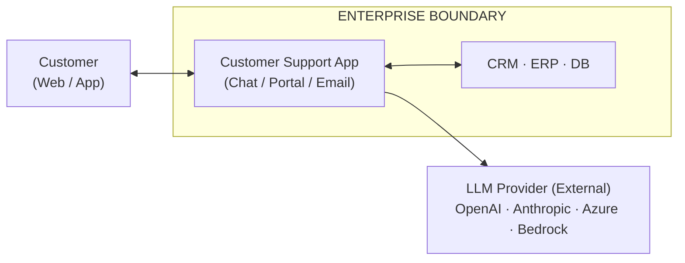
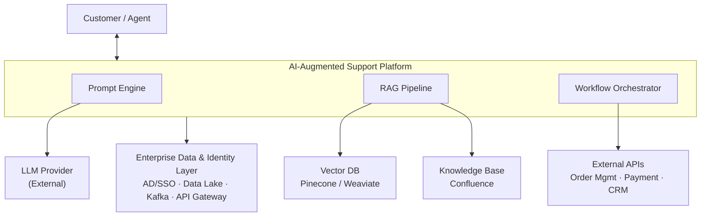
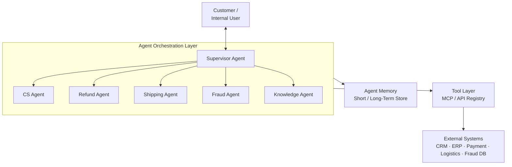
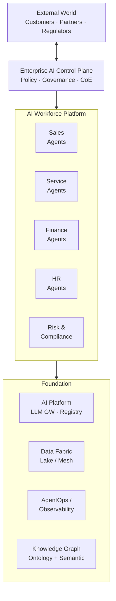

# Context Diagram — AI Evolution & Maturity Platform

## System Context

The AI Evolution Platform is an enterprise capability that sits between business users, customers, and the underlying AI/data infrastructure. It evolves across 11 maturity levels — each level expanding the system boundary to include more autonomous, intelligent capabilities.

---

## Level 0–2 Context (Traditional → Prompt Engineering)

---

## Level 3–5 Context (RAG → Workflow AI)

---

## Level 6–7 Context (Single Agent → Multi-Agent)

---

## Level 8–10 Context (Agentic Enterprise → Autonomous Enterprise)

---

## External Actors & Systems

| Actor / System | Type | Interaction |
|---|---|---|
| End Customer | Human | Chat, Email, Portal, Voice |
| Enterprise Employee | Human | Internal tooling, dashboards |
| LLM Provider | External SaaS | API calls (OpenAI, Anthropic, Bedrock) |
| Vector Database | External/Internal | Embedding storage & retrieval |
| CRM (Salesforce etc.) | Internal System | Customer data read/write |
| ERP (SAP etc.) | Internal System | Order, inventory, finance data |
| Payment Gateway | External | Refund/payment processing |
| Identity Provider (AD/SSO) | Internal | AuthN/AuthZ |
| Event Bus (Kafka) | Internal | Async messaging between agents |
| Monitoring Platform | Internal | Logs, traces, metrics |
| Regulatory Bodies | External | Compliance reporting |
| AI Model Registry | Internal | Model versioning and promotion |
