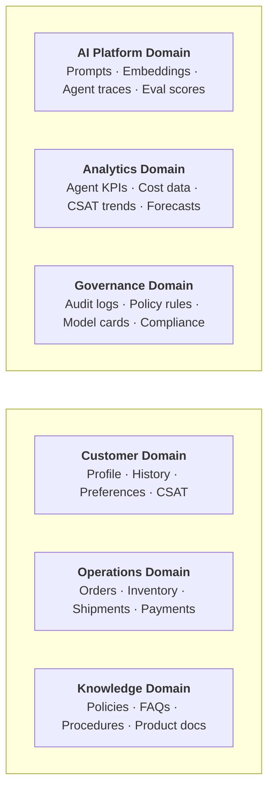
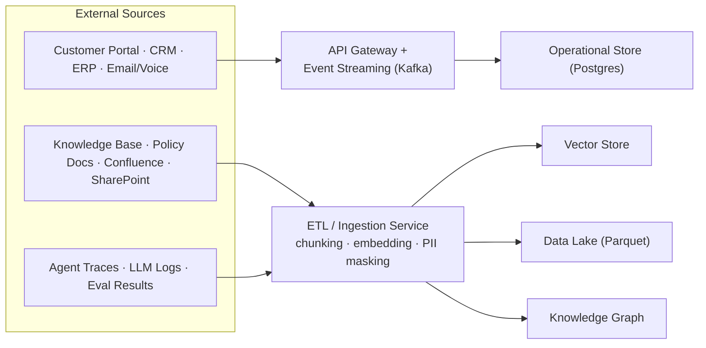
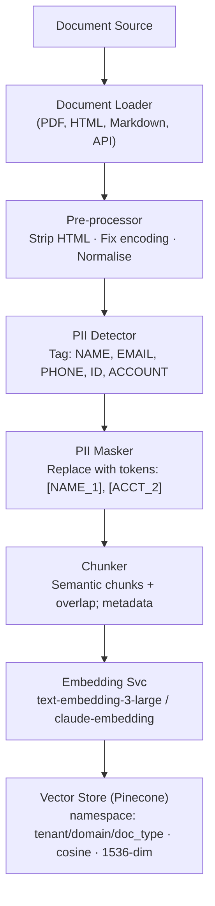
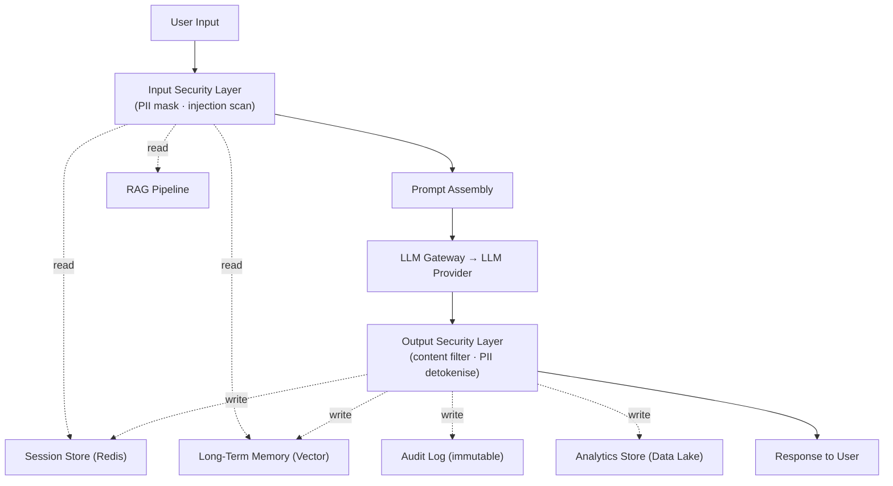
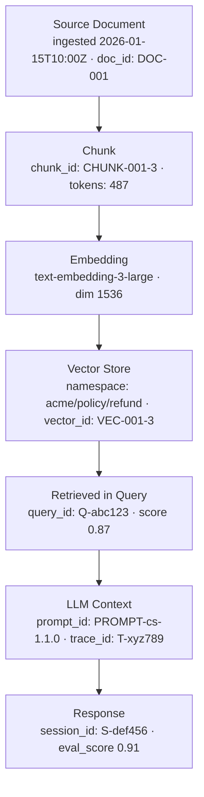

# Data Architecture & Flow Diagram — AI Evolution & Maturity Platform

## 1. Data Architecture Principles

| Principle | Description |
|---|---|
| Data as a Product | Every dataset has an owner, schema, SLA, and consumers |
| Privacy by Design | PII classified and controlled at point of ingestion |
| Federated Governance | Central policy, domain ownership |
| Single Source of Truth | No duplicated master data — operational systems are authoritative |
| AI-Ready by Default | All data pipelines output AI-consumable formats |

---

## 2. Data Domains

---

## 3. Master Data Flow

### 3.1 Ingestion Flow

### 3.2 RAG Data Flow

### 3.3 Agent Data Flow (Runtime)

---

## 4. Data Classification

| Classification | Description | Examples | Controls |
|---|---|---|---|
| **Confidential** | Highest sensitivity — regulatory impact | Payment card data, SSN, health info | Encrypted at rest + in transit; no LLM exposure; audit on every access |
| **Private** | Personal or business-sensitive | Customer name, email, order history | PII masking before LLM; tenant namespace isolation |
| **Internal** | Non-public business data | Agent traces, cost data, model configs | Role-based access; not exposed externally |
| **Public** | Safe to share externally | Product docs, published FAQs, policies | No restrictions; safe for LLM context |

---

## 5. Data Storage Architecture

| Store | Technology | Data | Retention | Encryption |
|---|---|---|---|---|
| Operational DB | PostgreSQL (HA) | Customers, orders, payments, tickets | Indefinite | AES-256 |
| Vector Store | Pinecone | Document embeddings (per tenant namespace) | Until document deleted | AES-256 |
| Short-term Memory | Redis Cluster | Conversation context, session state | 30 minutes TTL | In-transit TLS |
| Long-term Memory | Pinecone (separate index) | User entity memory, preferences | 12 months rolling | AES-256 |
| Knowledge Graph | Neo4j | Entity relationships, ontology | Indefinite | AES-256 |
| Data Lake | S3 / ADLS (Parquet) | Agent traces, eval results, LLM logs | 7 years | SSE-KMS |
| Prompt Store | PostgreSQL + Git | Prompt templates, versions | Indefinite (versioned) | AES-256 |
| Audit Log | Immutable Object Storage | All AI actions, tool calls, auth events | 7 years WORM | AES-256 |
| Analytics Warehouse | Snowflake / BigQuery | Aggregated KPIs, cost reports | 3 years | Platform-native |

---

## 6. Data Lineage

Every step is recorded in the Data Lake with full lineage metadata — supporting audit, debugging, and model improvement.

---

## 7. Data Quality

| Dimension | Control | Threshold |
|---|---|---|
| Completeness | Required fields validated at ingestion | 100% |
| Freshness | Document TTL alerts for stale knowledge | > 90 days → alert |
| Embedding Coverage | % of documents with valid embeddings | > 99% |
| Retrieval Quality | RAGAS context precision score | > 0.75 |
| PII Detection Rate | % of PII correctly identified | > 99.5% |
| Duplicate Detection | Cosine similarity dedup at ingestion | Threshold > 0.98 → deduplicate |

---

## 8. Data Governance

| Control | Implementation |
|---|---|
| Data Catalogue | All datasets registered with owner, schema, sensitivity, consumers |
| Access Control | Column-level security on operational DB; namespace isolation on vector store |
| Right to Erasure | API to delete all user data across all stores (GDPR Article 17) |
| Data Residency | Tenant namespace pinned to cloud region; cross-region replication opt-in only |
| Schema Registry | All Kafka events use Avro schema with compatibility checks |
| Data Retention Policies | Automated lifecycle rules per store (S3 lifecycle, Redis TTL, PostgreSQL partitioning) |
