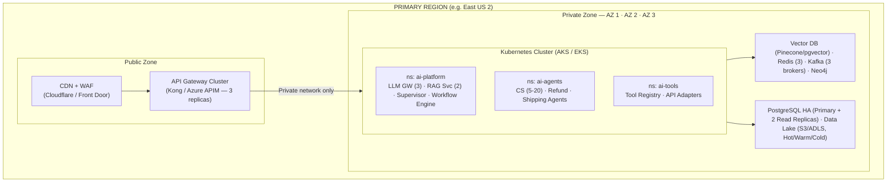
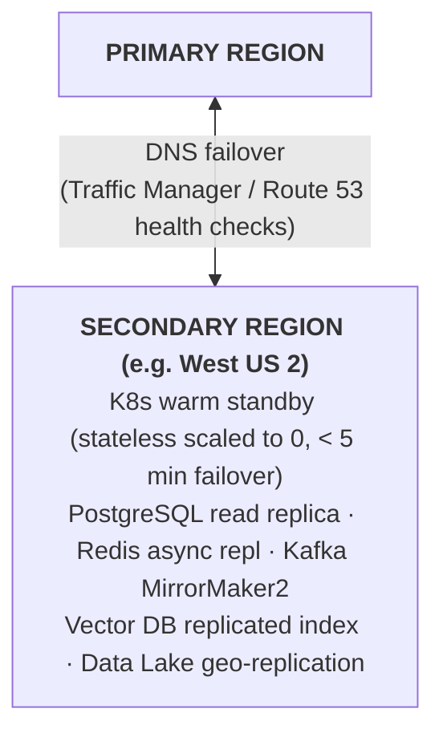
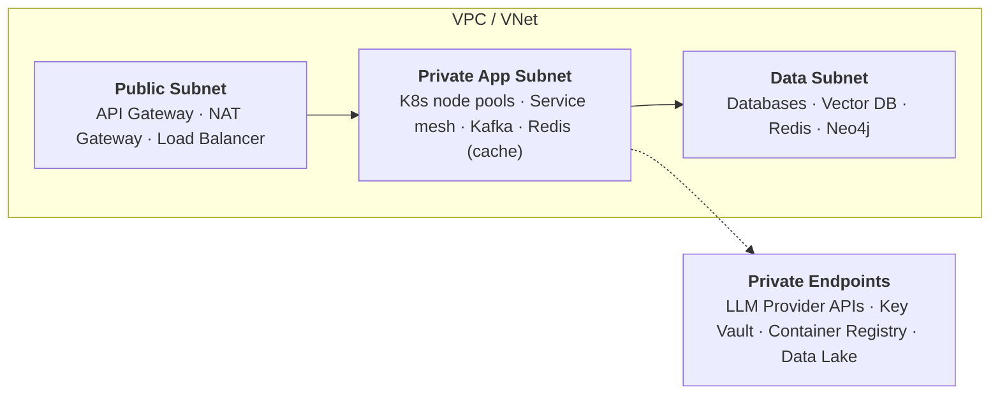
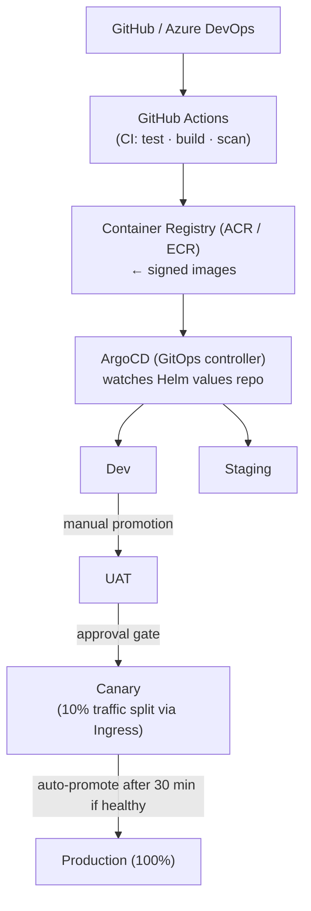
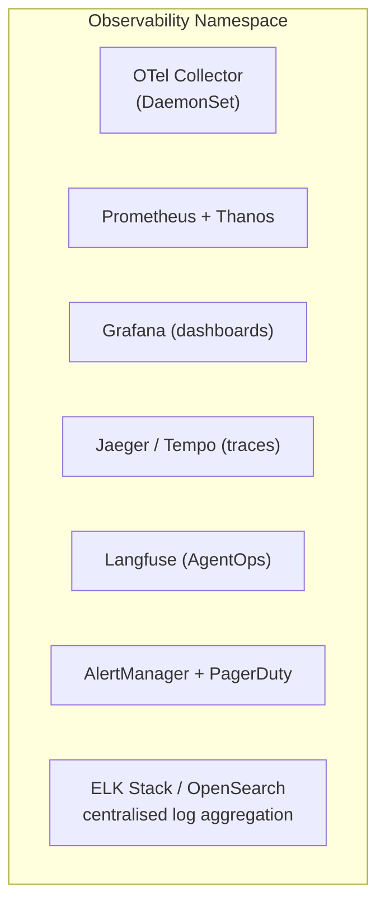
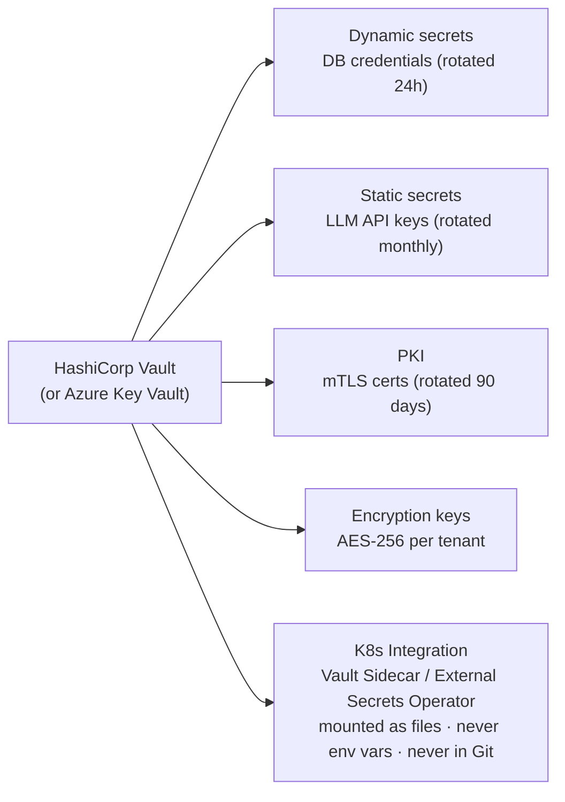

# Deployment Architecture — AI Evolution & Maturity Platform

## 1. Cloud Topology

### 1.1 Primary Region Architecture (Active)



### 1.2 Secondary Region Architecture (Passive / Active-Active for L8+)



---

## 2. Network Architecture



> **Network Policies (Kubernetes):** Default deny-all ingress + egress · explicit allow rules per service pair · no direct pod-to-internet (egress via approved proxy only).

---

## 3. Kubernetes Cluster Design

### 3.1 Node Pool Strategy

| Node Pool | Instance Type | Min/Max Nodes | Purpose |
|---|---|---|---|
| system | Standard_D4s_v5 | 3/3 | K8s system components (fixed) |
| ai-platform | Standard_D8s_v5 | 3/10 | LLM GW, RAG, Supervisor |
| ai-agents | Standard_D4s_v5 | 2/50 | Agent pods (HPA-driven) |
| ai-data | Standard_D8s_v5 | 2/6 | Vector DB operators, Kafka |
| gpu (optional) | Standard_NC6s_v3 | 0/4 | Local embedding models |
| monitoring | Standard_D4s_v5 | 2/4 | Observability stack |

### 3.2 Resource Quotas per Namespace

| Namespace | CPU Request | CPU Limit | Memory Request | Memory Limit |
|---|---|---|---|---|
| ai-platform | 8 cores | 32 cores | 16Gi | 64Gi |
| ai-agents | 4 cores | 100 cores | 8Gi | 200Gi |
| ai-tools | 2 cores | 8 cores | 4Gi | 16Gi |
| ai-monitoring | 4 cores | 8 cores | 8Gi | 16Gi |

---

## 4. Multi-Tenancy Architecture

```
Tenant: Acme Corp                    Tenant: Beta Inc
──────────────                       ──────────────
K8s Namespace: acme/                 K8s Namespace: beta/
Vector Index Namespace: acme/*       Vector Index Namespace: beta/*
Kafka Topic Prefix: acme.*           Kafka Topic Prefix: beta.*
Redis Key Prefix: acme:              Redis Key Prefix: beta:
Data Lake Path: s3://dl/acme/        Data Lake Path: s3://dl/beta/
Audit Log Partition: tenant=acme     Audit Log Partition: tenant=beta

Shared (single-instance, logical isolation):
  - LLM Gateway (tenant header routing)
  - API Gateway (tenant JWT claims)
  - Observability (tenant label filtering)
```

---

## 5. External Service Connectivity

| Service | Connectivity | Authentication |
|---|---|---|
| Anthropic API | Private endpoint / internet with IP allowlist | API key (Vault) |
| OpenAI API | Internet with TLS + IP allowlist | API key (Vault) |
| AWS Bedrock | VPC endpoint | IAM role (IRSA) |
| Pinecone | Internet with TLS | API key (Vault) |
| Salesforce CRM | Site-to-site VPN or private link | OAuth client credentials |
| SAP ERP | VPN / ExpressRoute | Service account |
| Payment Gateway | Internet with TLS + IP allowlist | API key + HMAC signing |

---

## 6. CI/CD Deployment Flow



---

## 7. Observability Infrastructure Deployment



---

## 8. Secrets Management



---

## 9. Deployment Checklist per Environment

| Check | Dev | Staging | Prod |
|---|---|---|---|
| All container images signed | Recommended | Required | Required |
| Network policies applied | Recommended | Required | Required |
| Resource quotas set | Recommended | Required | Required |
| HPA configured | Optional | Required | Required |
| PodDisruptionBudget set | No | Required | Required |
| ReadinessProbe configured | Required | Required | Required |
| LivenessProbe configured | Required | Required | Required |
| Secrets from Vault only | Recommended | Required | Required |
| mTLS enabled (Istio) | Optional | Required | Required |
| Observability agents running | Required | Required | Required |
| DR tested | No | Quarterly | Quarterly |
