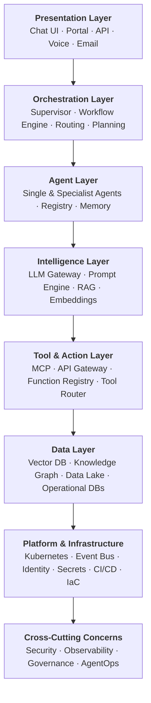
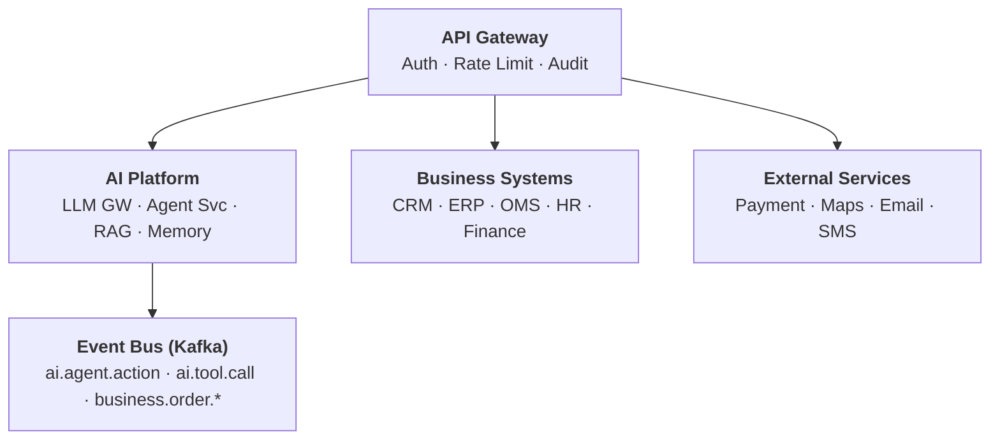

# High-Level Design — AI Evolution & Maturity Platform

## 1. Purpose

This document describes the high-level architecture of an enterprise AI platform that evolves from basic prompt-based AI (Level 1) through to a fully Autonomous Enterprise (Level 10). The design is cumulative — each layer is additive and does not replace the prior layer.

---

## 2. Architectural Principles

| Principle | Description |
|---|---|
| Cumulative Evolution | Each maturity level adds capability without discarding previous layers |
| API-First | Every AI capability is exposed as an API; no tight coupling |
| Governance by Design | Security, audit, and compliance are embedded at every level |
| Observable Everything | All AI decisions, tool calls, and agent actions are traceable |
| Human-in-the-Loop | Configurable escalation and human override at every level |
| Vendor-Agnostic LLM | LLM Gateway abstracts all model providers |

---

## 3. Layered Architecture Overview

---

## 4. Component Descriptions by Layer

### 4.1 Presentation Layer

| Component | Purpose |
|---|---|
| Chat UI | Real-time conversational interface (React / Next.js) |
| Customer Portal | Self-service web app |
| API Gateway | External API entry point (Kong / Azure APIM) |
| Voice Interface | IVR or voice-to-text integration |
| Email Processor | Inbound email parsing and response |

### 4.2 Orchestration Layer

| Component | Purpose |
|---|---|
| Agent Supervisor | Routes requests to appropriate specialist agents |
| Workflow Engine | Executes multi-step AI workflows (LangGraph / Temporal) |
| Intent Router | Classifies user intent and dispatches to correct flow |
| Planner | Generates step-by-step plans for complex requests |
| State Manager | Maintains conversation and workflow state |

### 4.3 Agent Layer

| Component | Purpose |
|---|---|
| Agent Runtime | Executes agent loops (reason → act → observe) |
| Agent Registry | Catalogue of available agents and their capabilities |
| Memory Store | Short-term (conversation) and long-term (user/entity) memory |
| Reflection Engine | Post-execution self-evaluation and error correction |

### 4.4 Intelligence Layer

| Component | Purpose |
|---|---|
| LLM Gateway | Unified interface to all LLM providers with fallback routing |
| Prompt Engine | Template management, versioning, A/B testing |
| RAG Pipeline | Document ingestion, chunking, embedding, retrieval |
| Embedding Service | Converts text to vector representations |
| Reranker | Improves retrieval relevance with cross-encoder ranking |

### 4.5 Tool & Action Layer

| Component | Purpose |
|---|---|
| MCP Server | Model Context Protocol — standardised tool exposure |
| Function Registry | Catalogue of callable tools and their schemas |
| Tool Router | Selects and invokes the correct tool from LLM output |
| API Adapter | Normalises calls to external CRM, ERP, payment systems |
| Event Producer | Publishes domain events to the event bus |

### 4.6 Data Layer

| Component | Purpose |
|---|---|
| Vector Database | Stores embeddings for semantic search (Pinecone / Weaviate / pgvector) |
| Knowledge Graph | Semantic entity relationships (Neo4j / Amazon Neptune) |
| Data Lake | Historical data for analytics and model fine-tuning |
| Operational Databases | CRM, ERP, Order Management transactional stores |
| Document Store | Policy, procedure, and knowledge base documents |

---

## 5. Capability Activation by Maturity Level

```mermaid
flowchart LR
  L0["L0<br/>Presentation → Data"] -->
  L1["L1<br/>+ LLM Gateway"] -->
  L2["L2<br/>+ Prompt Engine"] -->
  L3["L3<br/>+ RAG + Vector DB"] -->
  L4["L4<br/>+ Tool Layer"] -->
  L5["L5<br/>+ Workflow Engine"] -->
  L6["L6<br/>+ Agent Runtime + Memory"] -->
  L7["L7<br/>+ Supervisor + Multi-Agent"] -->
  L8["L8<br/>+ Domain Ecosystems + KG"] -->
  L9["L9<br/>+ AI Workforce + Governance"] -->
  L10["L10<br/>+ Autonomous Loop + AI CoE"]
```

---

## 6. Technology Stack (Reference)

| Layer | Options |
|---|---|
| LLM Models | Claude (Anthropic) · GPT-4o (OpenAI) · Gemini · Llama 3 |
| LLM Gateway | LiteLLM · AWS Bedrock Gateway · Azure AI Studio |
| Agent Framework | LangGraph · AutoGen · CrewAI · Custom |
| Workflow Engine | Temporal · Apache Airflow · LangGraph |
| Vector DB | Pinecone · Weaviate · pgvector · Qdrant |
| Knowledge Graph | Neo4j · Amazon Neptune · Azure Cosmos Gremlin |
| Event Bus | Apache Kafka · Azure Service Bus · AWS EventBridge |
| API Gateway | Kong · Azure APIM · AWS API Gateway |
| Container Platform | Kubernetes (AKS / EKS / GKE) |
| Observability | OpenTelemetry · Datadog · Langfuse · Arize |
| Identity | Azure AD · Okta · AWS IAM |
| IaC | Terraform · Pulumi |

---

## 7. Key Architectural Decisions

### ADR-001: LLM Gateway as Abstraction
All LLM calls route through a centralised gateway. This enables model swapping, cost control, fallback routing, and unified audit logging without changing agent or application code.

### ADR-002: MCP for Tool Standardisation
Model Context Protocol (MCP) is the standard for exposing tools to agents. This ensures tool schemas are discoverable, versioned, and interoperable across agent frameworks.

### ADR-003: Event-Driven Agent Communication
Agents communicate via an event bus (Kafka) for asynchronous, decoupled operation. Synchronous gRPC is used only for latency-sensitive, low-latency agent-to-agent calls.

### ADR-004: Dual Memory Architecture
Agents use in-memory (Redis) for short-term conversation context and a persistent vector store for long-term user/entity memory. Memory is namespaced per tenant and user.

### ADR-005: Human-in-the-Loop by Default
All agent actions above a configurable confidence threshold or impacting financial transactions require human approval. This is enforced at the Tool Router layer, not individual agent code.

---

## 8. Integration Architecture

---

## 9. Scalability & Resilience

| Concern | Approach |
|---|---|
| LLM latency | Streaming responses · async processing · caching |
| Agent throughput | Horizontal pod autoscaling per agent type |
| LLM provider outage | Multi-provider fallback in LLM Gateway |
| Memory consistency | Event sourcing + CQRS for agent state |
| Tool failure | Circuit breaker + retry with exponential backoff |
| Cost overrun | Token budgets per request, per user, per tenant |
