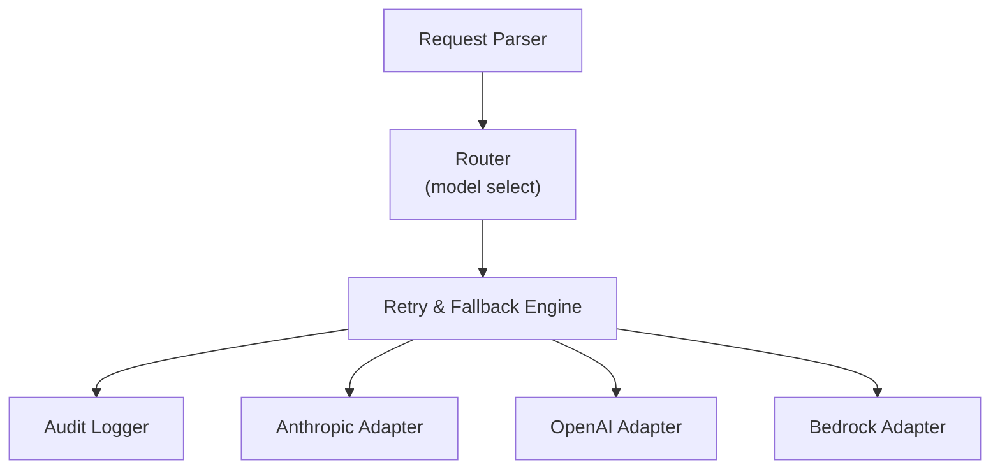
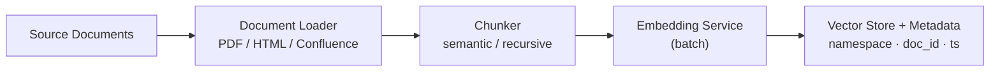
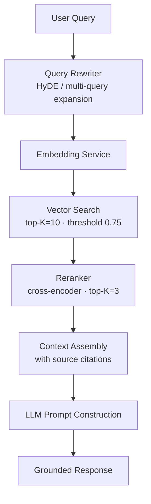
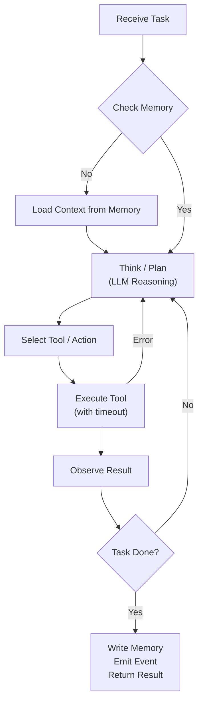
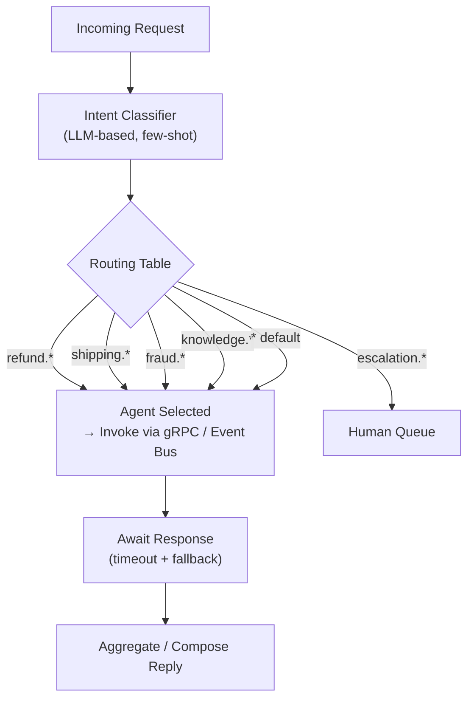
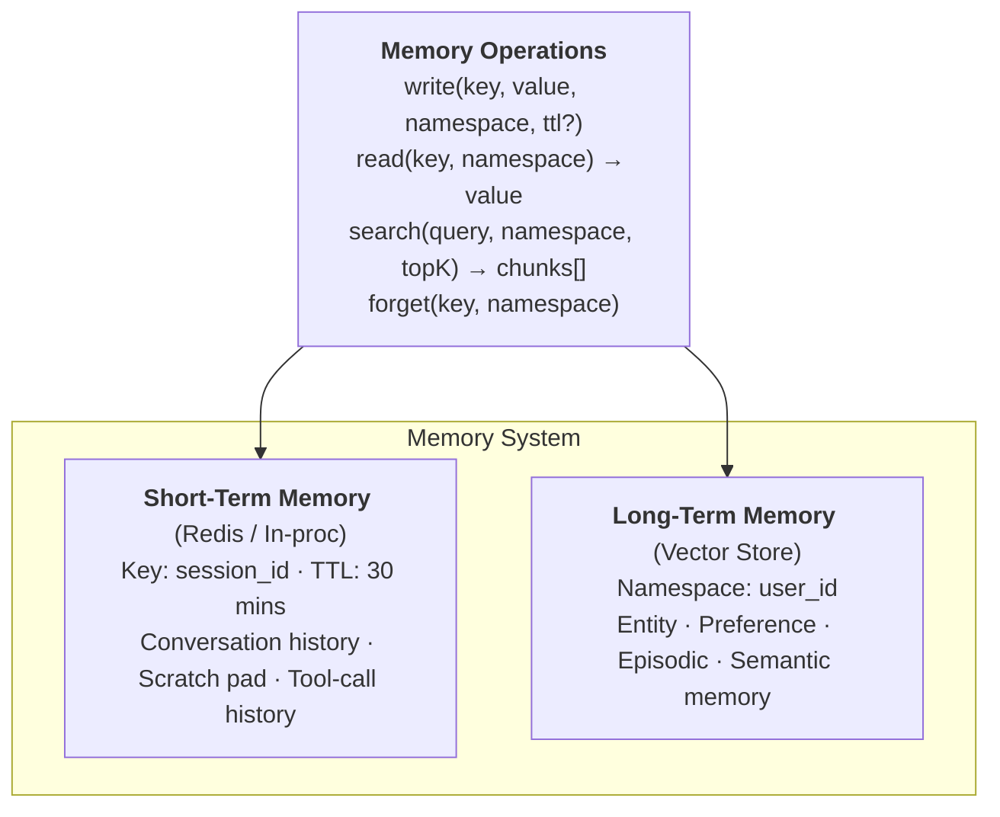
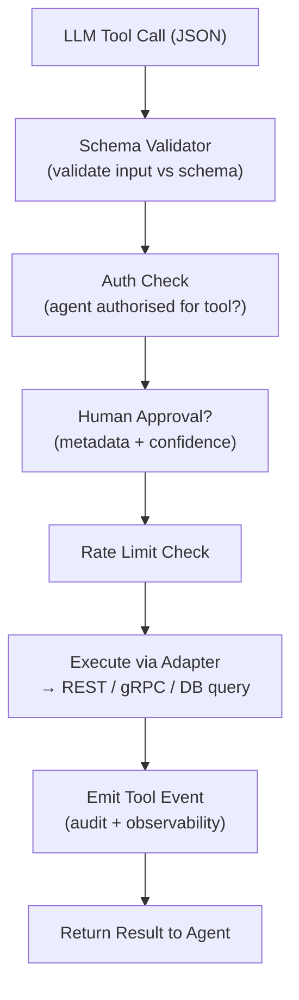
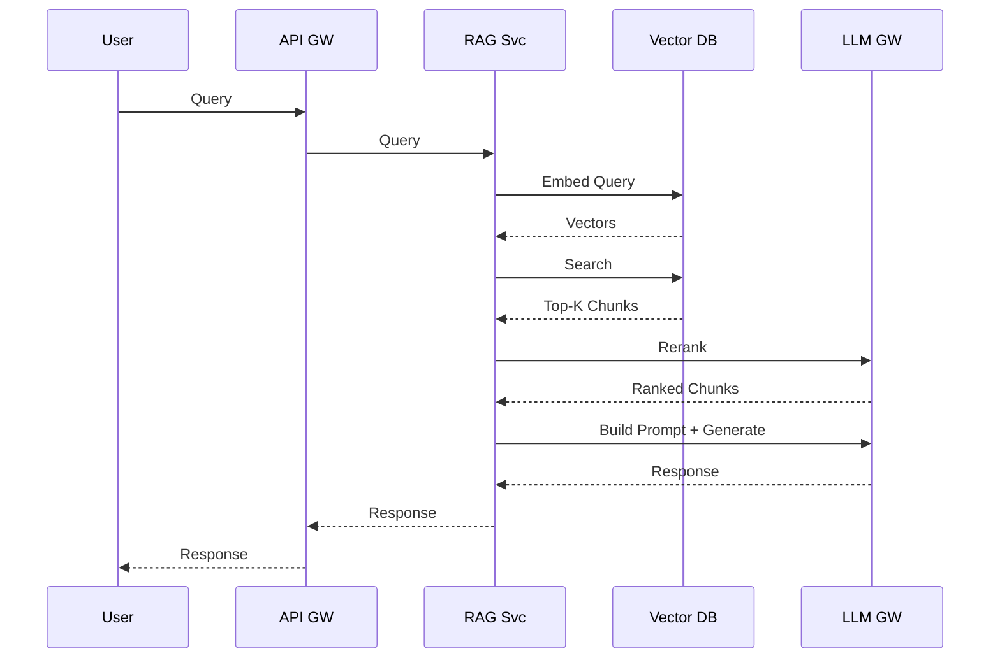
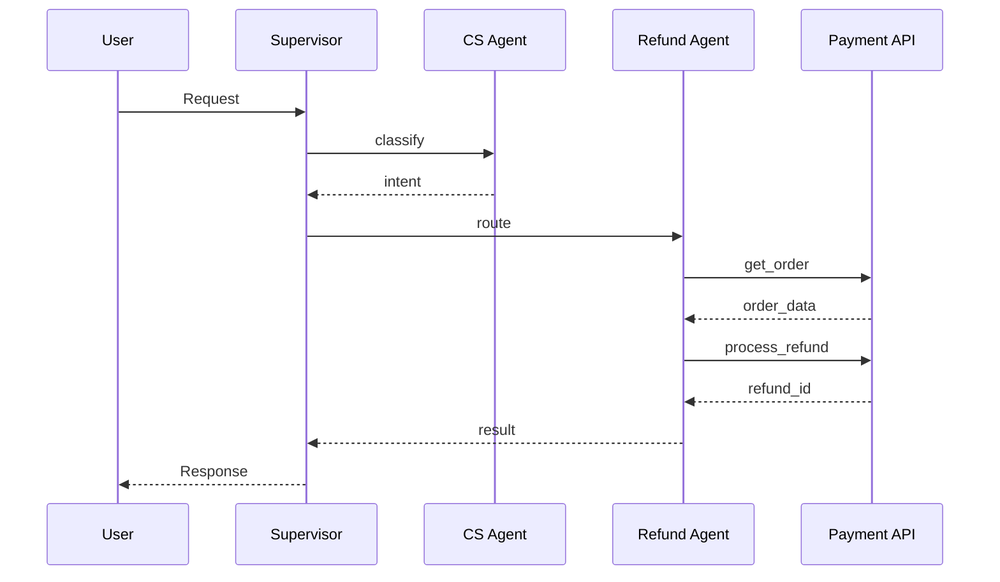

# Low-Level Design — AI Evolution & Maturity Platform

## 1. Component Specifications

### 1.1 LLM Gateway

**Responsibility:** Abstract all LLM provider calls behind a single, consistent interface.



**API Contract:**

```typescript
interface LLMRequest {
  model?: string;            // defaults to configured primary model
  messages: Message[];
  tools?: ToolDefinition[];
  temperature?: number;
  maxTokens?: number;
  stream?: boolean;
  budgetTokens?: number;     // hard cap on total tokens
  tenantId: string;
  traceId: string;
}

interface LLMResponse {
  content: string | ContentBlock[];
  model: string;             // actual model used (may differ due to fallback)
  usage: TokenUsage;
  toolCalls?: ToolCall[];
  traceId: string;
}
```

**Routing Logic:**

```
1. Parse request model preference
2. Check model availability (health check cache, 30s TTL)
3. If primary unavailable → route to fallback chain
4. Apply token budget check
5. Forward to provider adapter
6. On 429/503 → exponential backoff + retry (max 3)
7. Log request/response to audit store
8. Return normalised response
```

---

### 1.2 RAG Pipeline

**Ingestion Flow:**



**Query Flow:**



**Chunking Strategy:**

| Document Type | Strategy | Chunk Size | Overlap |
|---|---|---|---|
| Policy docs | Semantic (sentence boundary) | 512 tokens | 50 tokens |
| FAQs | Fixed paragraph | 256 tokens | 0 |
| Product manuals | Hierarchical (section → subsection) | 1024 tokens | 100 tokens |
| Emails | Full document | N/A | N/A |

---

### 1.3 Agent Runtime

**Agent Loop:**



**Agent Data Model:**

```typescript
interface Agent {
  id: string;
  name: string;
  role: string;
  systemPrompt: string;
  tools: string[];           // tool IDs from Function Registry
  memoryConfig: {
    shortTermTTL: number;    // seconds
    longTermEnabled: boolean;
    namespace: string;
  };
  escalationPolicy: {
    confidenceThreshold: number;
    maxIterations: number;
    humanApprovalRequired: boolean;
  };
  metadata: {
    version: string;
    tenantId: string;
    domain: string;
  };
}
```

---

### 1.4 Supervisor Agent (Multi-Agent Routing)

**Routing Decision Flow:**



---

### 1.5 Memory Architecture



---

### 1.6 Tool / Function Registry

**Tool Definition Schema (MCP-compatible):**

```json
{
  "name": "get_order_status",
  "description": "Retrieve the current status of a customer order by order ID",
  "inputSchema": {
    "type": "object",
    "properties": {
      "order_id": {
        "type": "string",
        "description": "The unique order identifier"
      }
    },
    "required": ["order_id"]
  },
  "metadata": {
    "domain": "order_management",
    "requiresAuth": true,
    "humanApproval": false,
    "timeout_ms": 5000,
    "rateLimit": "100/min"
  }
}
```

**Tool Execution Pipeline:**



---

## 2. Data Models

### 2.1 Conversation

```typescript
interface Conversation {
  id: string;
  tenantId: string;
  userId: string;
  sessionId: string;
  channel: 'chat' | 'email' | 'voice' | 'api';
  messages: ConversationMessage[];
  agentId: string;
  workflowId?: string;
  status: 'active' | 'resolved' | 'escalated' | 'abandoned';
  metadata: Record<string, unknown>;
  createdAt: Date;
  updatedAt: Date;
}

interface ConversationMessage {
  id: string;
  role: 'user' | 'assistant' | 'tool' | 'system';
  content: string;
  toolCall?: ToolCall;
  toolResult?: ToolResult;
  timestamp: Date;
  traceId: string;
}
```

### 2.2 Agent Execution Trace

```typescript
interface AgentTrace {
  traceId: string;
  agentId: string;
  conversationId: string;
  iterations: AgentIteration[];
  totalTokens: number;
  totalLatencyMs: number;
  outcome: 'success' | 'failure' | 'escalated' | 'timeout';
  cost: number;
}

interface AgentIteration {
  iterationNumber: number;
  thought: string;
  action: string;
  observation: string;
  toolsCalled: ToolCall[];
  tokensUsed: number;
  latencyMs: number;
}
```

---

## 3. API Specifications

### 3.1 Agent Invocation API

```
POST /v1/agents/{agentId}/invoke
Authorization: Bearer <token>
X-Tenant-Id: <tenantId>
X-Trace-Id: <traceId>

{
  "input": "Cancel my order ORD-12345 and process a refund",
  "sessionId": "sess_abc123",
  "userId": "usr_xyz789",
  "context": {
    "channel": "chat",
    "locale": "en-US"
  }
}

Response 200:
{
  "output": "I've cancelled order ORD-12345...",
  "traceId": "trace_...",
  "agentId": "cs-agent-v2",
  "toolsUsed": ["get_order", "cancel_order", "process_refund"],
  "tokensUsed": 1240,
  "latencyMs": 2800
}
```

### 3.2 Workflow Trigger API

```
POST /v1/workflows/{workflowId}/trigger
{
  "input": { "orderId": "ORD-12345", "reason": "defective" },
  "callbackUrl": "https://app.example.com/webhooks/workflow"
}

Response 202:
{
  "executionId": "wf-exec-...",
  "status": "running",
  "estimatedDurationSeconds": 45
}
```

---

## 4. Sequence Diagrams

### 4.1 RAG Query (Level 3)



### 4.2 Multi-Agent Execution (Level 7)



---

## 5. Error Handling

| Error Type | Strategy | User Impact |
|---|---|---|
| LLM timeout | Retry x3 → fallback model → error message | Minor delay |
| Tool execution failure | Retry x2 → log → inform agent | Agent replans |
| Agent iteration limit | Force stop → escalate to human | Escalation |
| RAG retrieval empty | Proceed without context + caveat in response | Potentially less accurate |
| Memory write failure | Log warning, continue (non-blocking) | None |
| Auth failure | Reject immediately + audit log | Hard stop |
| Budget exceeded | Stop generation + partial response | Truncated response |
