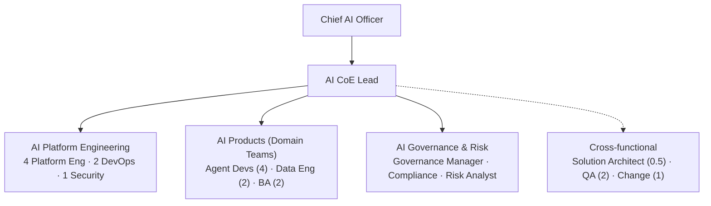
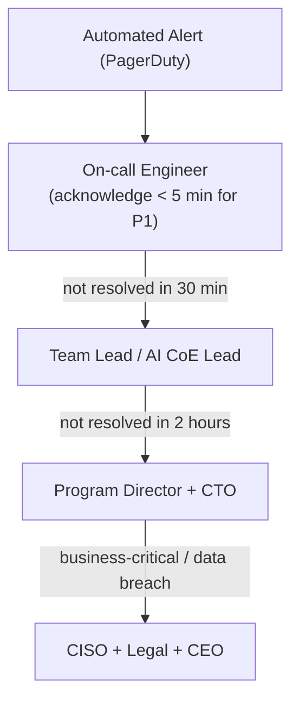
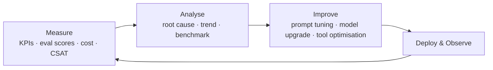

# Operating Model — AI Evolution & Maturity Platform

## 1. Overview

This document defines how the AI platform is operated after each phase go-live, covering team structure, support model, change management, continuous improvement, and AI CoE maturity.

---

## 2. Operating Model Evolution

```
Phase 1–4 (Build & Learn)          Phase 5–7 (Scale)             Phase 8–10 (Operate)
─────────────────────────          ─────────────────             ──────────────────
Program team runs operations       Dedicated ops team forms       AI CoE fully operational
SI partner heavily involved        SI partner transitions out     Internal team self-sufficient
Best-effort SLAs                   Defined SLAs                   SLA-governed with KPIs
Reactive incident response         Proactive monitoring           Autonomous self-healing
Manual deployments w/ oversight    GitOps fully adopted           AI-assisted deployments
```

---

## 3. Team Structure (Steady State — Phase 9+)



---

## 4. Support Model

### 4.1 Support Tiers

| Tier | Description | Handled By | SLA |
|---|---|---|---|
| **Tier 0** | Self-service: documentation, runbooks, status page | Automated / self-serve | Immediate |
| **Tier 1** | Basic operational issues: pod restarts, config issues | DevOps on-call | < 30 min acknowledge |
| **Tier 2** | Agent quality issues, integration failures | AI Platform + Agent Dev | < 4 hours |
| **Tier 3** | Complex AI quality, model governance, security incidents | AI CoE + Security | < 24 hours |
| **Tier 4** | Vendor escalation (LLM provider, Pinecone, cloud) | Platform Eng + Vendor | Per vendor SLA |

### 4.2 On-Call Rotation

| Rotation | Scope | Team Members | Cadence |
|---|---|---|---|
| Platform on-call | Infrastructure, K8s, LLM GW, APIs | DevOps (2) + Platform Eng (2) | 24/7; weekly rotation |
| AI quality on-call | Agent quality, safety incidents | AI CoE Lead + Agent Dev (2) | Business hours + on-call P1 |
| Security on-call | Security incidents, PII events | Security Eng + CISO escalation | 24/7; monthly rotation |

### 4.3 Escalation Path



---

## 5. Change Management

### 5.1 Change Types & Approval

| Change Type | Description | Approval | Process |
|---|---|---|---|
| **Standard** | Routine deployments from CI/CD (pre-approved patterns) | Automated (GitHub Actions) | GitOps → staging → canary → prod |
| **Normal** | Non-routine changes (new tool, config change) | Platform Tech Lead | Change request; 48h review |
| **Emergency** | P1 incident fix | AI CoE Lead or on-call lead | Fast-track; post-change review |
| **Major** | New agent type, new model, new integration | AI Review Board | Phase gate process |

### 5.2 Change Freeze Policy

- **Release freeze:** 48 hours before month-end and quarter-end (financial systems)
- **Emergency changes:** exempt from freeze; require CISO or CTO approval
- **Planned maintenance:** 4-hour window, first Sunday of month, 02:00–06:00 UTC

---

## 6. Continuous Improvement Cycle



**Cadence:**
- Daily: automated quality scores reviewed in dashboard
- Weekly: AI ops review (agent KPIs, cost, errors)
- Monthly: AI CoE continuous improvement meeting
- Quarterly: strategic AI review (model upgrades, new capabilities, cost optimisation)

---

## 7. KPI Ownership & Reporting

| KPI | Owner | Reporting Frequency | Dashboard |
|---|---|---|---|
| AI containment rate | VP Customer Experience | Weekly | Executive |
| CSAT score | VP Customer Experience | Daily | Executive |
| Agent task success rate | AI CoE Lead | Daily | Operations |
| Faithfulness score | AI CoE Lead | Daily | AI Quality |
| LLM cost per session | Platform Eng | Daily | Cost |
| Escalation rate | Operations Manager | Daily | Operations |
| System availability | DevOps/SRE | Real-time | Operations |
| Security incidents | Security Eng | Monthly | Governance |
| Bias audit scores | AI CoE | Quarterly | Governance |

---

## 8. Knowledge Management

| Artifact | Owner | Review Cadence |
|---|---|---|
| Runbooks | DevOps / SRE | After every incident |
| Architecture decision records | Solution Architect | After every major decision |
| Agent prompt library | Agent Dev | After every prompt change |
| Model cards | AI CoE | After every model update |
| Integration contracts | Platform Eng | After every API change |
| Security playbooks | Security Eng | Quarterly |
| Training materials | Change Manager | Annually or after major change |

---

## 9. AI CoE Maturity Progression

| Phase | CoE Maturity | Description |
|---|---|---|
| P1–4 | **Emerging** | Ad-hoc practices; building capability; heavy SI reliance |
| P5–6 | **Developing** | Defined processes; dedicated roles; SI transitioning out |
| P7–8 | **Established** | Standardised practices; metrics-driven; internal team capable |
| P9+ | **Optimising** | Continuous improvement loop; industry-leading practices; internal expertise |

**AI CoE charter, governance, and tooling reviewed and updated at each maturity transition.**

---

## 10. Vendor Management

| Vendor | Review Cadence | Owner | Key SLAs Monitored |
|---|---|---|---|
| Anthropic | Quarterly | AI CoE Lead | API availability, pricing, model updates |
| OpenAI | Quarterly | Platform Eng | API availability, fallback readiness |
| Pinecone | Monthly | Platform Eng | Query latency, index availability |
| SI Partner | Monthly | Program Director | Delivery quality, resource availability |
| Cloud (Azure) | Monthly | DevOps | Compute availability, SLA compliance |
| Langfuse | Quarterly | AI CoE | Eval pipeline availability, data retention |
