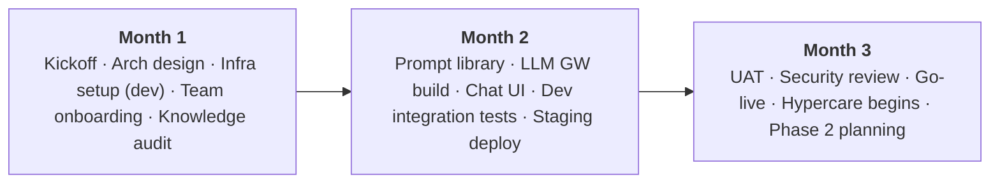
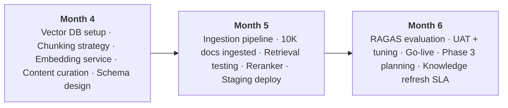
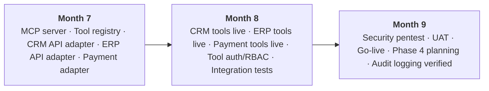
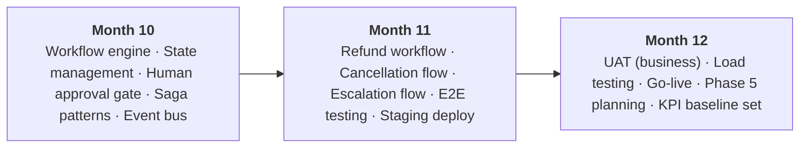
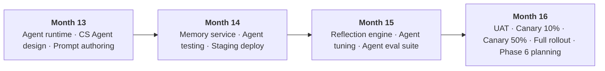
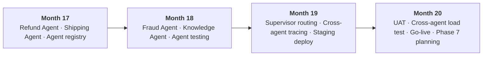
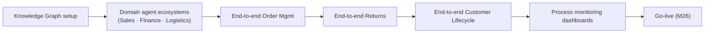
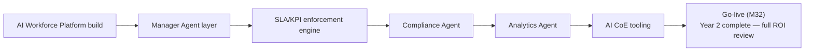
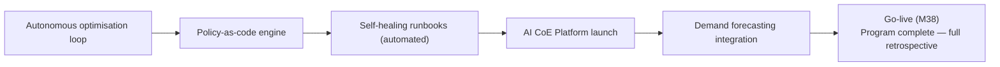
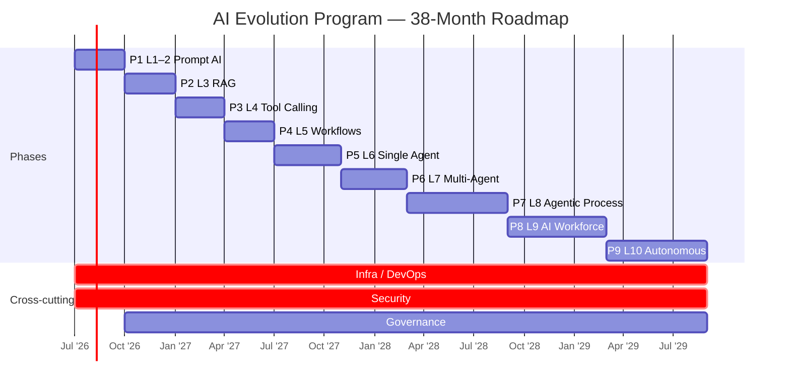

# Project Timeline & Roadmap — AI Evolution & Maturity Platform

## 1. Program Timeline Summary

**Program Start:** Month 1 (Q3 2026)
**Program End:** Month 38 (Q4 2029)
**Total Duration:** 38 months across 9 phases

---

## 2. Phase Summary

| Phase | Maturity | Months | Start | End | Key Milestone |
|---|---|---|---|---|---|
| 1 | L1–2 | 3 | M1 | M3 | AI chat assistant live |
| 2 | L3 | 3 | M4 | M6 | RAG knowledge base live |
| 3 | L4 | 3 | M7 | M9 | Tool-calling AI live |
| 4 | L5 | 3 | M10 | M12 | Workflows automated |
| 5 | L6 | 4 | M13 | M16 | Autonomous agent live |
| 6 | L7 | 4 | M17 | M20 | Multi-agent platform live |
| 7 | L8 | 6 | M21 | M26 | Agentic business processes |
| 8 | L9 | 6 | M27 | M32 | AI Workforce operating |
| 9 | L10 | 6 | M33 | M38 | Autonomous enterprise |

---

## 3. Detailed Phase Timelines

### Phase 1 — L1–2: Prompt AI (Months 1–3)

**Milestones:**
- M1W2: Architecture signed off
- M1W4: Dev environment running
- M2W4: Feature complete in staging
- M3W2: UAT signed off
- M3W4: Go-live ✓

---

### Phase 2 — L3: RAG (Months 4–6)

**Milestones:**
- M4W2: Vector DB operational
- M5W2: 10,000 documents indexed
- M5W4: RAGAS scores above threshold
- M6W4: Go-live ✓

---

### Phase 3 — L4: Tool Calling (Months 7–9)

**Milestones:**
- M7W3: MCP server with first 3 tools
- M8W4: All 10 tools live in staging
- M9W2: Security review clean
- M9W4: Go-live ✓

---

### Phase 4 — L5: Workflow AI (Months 10–12)

**Milestones:**
- M10W3: Workflow engine operational
- M11W4: 3 workflows live in staging
- M12W2: Load test: 1,000 concurrent sessions
- M12W4: Go-live ✓ | **Year 1 complete — review ROI vs forecast**

---

### Phase 5 — L6: Single Agent (Months 13–16)

**Milestones:**
- M13W4: Agent runtime operational
- M14W4: CS Agent passing all regression tests
- M15W4: Eval scores above threshold
- M16W4: Go-live ✓

---

### Phase 6 — L7: Multi-Agent (Months 17–20)

**Milestones:**
- M18W4: All 5 specialist agents built and tested
- M19W4: Supervisor routing accuracy > 95%
- M20W4: Go-live ✓ | **Interim ROI review**

---

### Phase 7 — L8: Agentic Business Process (Months 21–26)

---

### Phase 8 — L9: AI Workforce (Months 27–32)

---

### Phase 9 — L10: Autonomous Enterprise (Months 33–38)

---

## 4. Gantt Overview

---

## 5. Key Dependencies & Critical Path

| Dependency | Blocks | Risk |
|---|---|---|
| Cloud infra provisioned | All phases | Medium — lead time 2–4 weeks |
| CRM API documentation available | Phase 3 | Low — Salesforce docs available |
| ERP API test environment available | Phase 3 | High — SAP environments notoriously slow |
| Knowledge base content curated | Phase 2 | Medium — requires business SME time |
| Security review completed | Each phase go-live | Medium — resource contention |
| UAT business sign-off | Each phase go-live | Medium — business availability |
| LLM provider contract signed | Phase 1 | Low — standard commercial |
| Agent token budget approved | Phase 5 | Low — financial governance |

**Critical Path:** Phase 1 → Phase 2 → Phase 3 → Phase 4 (sequential; each phase builds on prior)
Phase 5 onward: some parallelism possible within phase (agent types built in parallel)

---

## 6. Key Decision Points

| Month | Decision | Options | Owner |
|---|---|---|---|
| M3 | Continue to Phase 2? | Go/No-Go based on Phase 1 KPIs | Steering Committee |
| M6 | Embedding model selection | text-embedding-3-large vs proprietary | AI CoE |
| M9 | Human approval thresholds | $500 / $1000 / $5000 | Legal + Finance |
| M12 | Year 1 ROI review | Continue full program / descope | CFO + CTO |
| M16 | Agent autonomy level | Supervised / semi-autonomous / autonomous | Steering + Legal |
| M20 | Multi-agent comms pattern | Sync gRPC / async Kafka / hybrid | Architecture |
| M26 | Knowledge Graph vendor | Neo4j / Amazon Neptune / Azure Cosmos | Platform Engineering |
| M32 | AI CoE permanent headcount | 3 FTE / 5 FTE / 8 FTE | CHRO + CTO |
