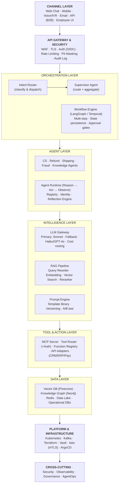
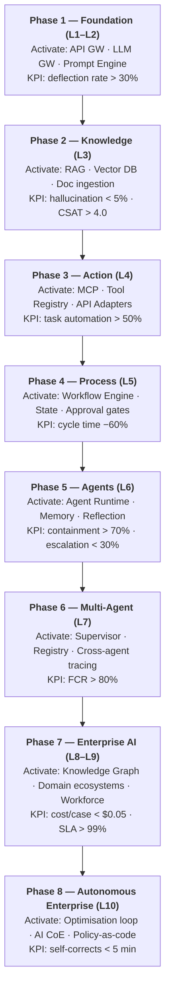
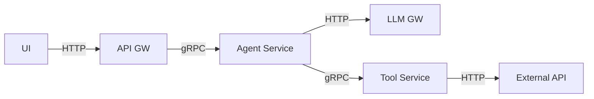
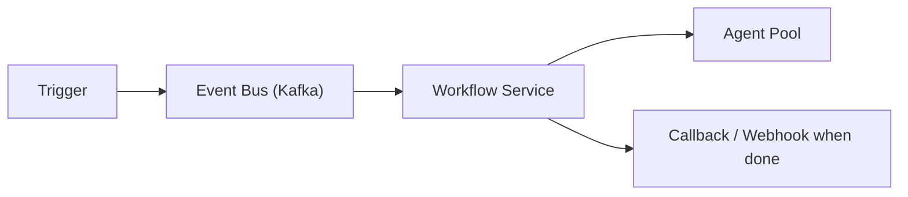
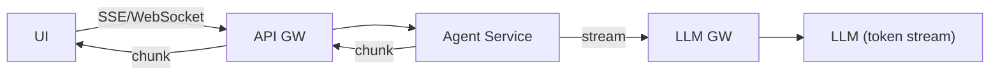
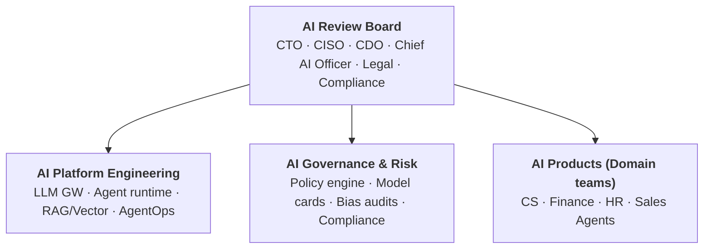

# Reference Architecture — AI Evolution & Maturity Platform

## 1. Purpose

This document is the canonical reference architecture for deploying an enterprise AI platform that evolves through the 10-level AI maturity model. It is intended for solution architects, AI CoE leads, and platform engineers to use as the definitive blueprint when designing, evaluating, or extending AI capabilities within the enterprise.

---

## 2. The Complete Reference Architecture

---

## 3. Maturity-Gated Adoption Map

The reference architecture is implemented incrementally. Teams activate new components as they advance maturity levels.

---

## 4. Technology Selection Guide

### 4.1 LLM Selection by Use Case

| Use Case | Recommended Model | Rationale |
|---|---|---|
| Simple FAQ / classification | Claude Haiku 4.5 | Fast, cheap, sufficient |
| Complex reasoning / planning | Claude Sonnet 4.6 | Balance of cost and capability |
| High-stakes decisions | Claude Opus 4.8 | Maximum reasoning depth |
| Real-time voice | GPT-4o mini | Low latency |
| Sensitive/regulated | On-premise Llama 3 | Data residency |
| Fine-tuned domain tasks | Custom fine-tuned | Domain-specific accuracy |

### 4.2 Vector Database Selection

| Requirement | Recommended | Alternative |
|---|---|---|
| Managed, scalable, cloud-native | Pinecone | Weaviate Cloud |
| Existing PostgreSQL stack | pgvector | — |
| On-premise / air-gapped | Weaviate (self-hosted) | Qdrant |
| High-throughput, low-latency | Qdrant | Redis Vector |
| Metadata filtering + vectors | Weaviate | Pinecone |

### 4.3 Agent Framework Selection

| Requirement | Recommended |
|---|---|
| Complex stateful workflows | LangGraph |
| Multi-agent + human-in-loop | LangGraph + LangSmith |
| Enterprise, .NET / Java | Semantic Kernel |
| Research / rapid prototyping | CrewAI |
| Production, code-first | Custom runtime on top of Anthropic SDK |

---

## 5. Integration Patterns

### 5.1 Synchronous (Low-latency, real-time)

Use for: Chat interactions, real-time query-answer, tool calls with < 5s SLA

### 5.2 Asynchronous (Long-running, background)

Use for: Refund processing, document analysis, batch knowledge ingestion

### 5.3 Streaming (Progressive response)

Use for: Chat UI, long-form generation, real-time reasoning display

---

## 6. Non-Functional Requirements

| NFR | Target | Mechanism |
|---|---|---|
| Chat response latency (P95) | < 3 seconds | Streaming + async tool calls |
| Agent task latency (P95) | < 30 seconds | Parallel tool execution |
| LLM Gateway availability | 99.9% | Multi-provider failover |
| Platform availability | 99.95% | Multi-AZ Kubernetes |
| RAG retrieval latency | < 200ms | Dedicated vector DB cluster |
| Token cost per session | < $0.10 | Model tiering + semantic caching |
| Data residency | Regional | Cloud region locks + on-prem option |
| Audit log retention | 7 years | Immutable object storage (WORM) |
| Recovery Time Objective | < 15 minutes | GitOps + automated rollback |
| Recovery Point Objective | < 5 minutes | Event sourcing + streaming backup |

---

## 7. AI Centre of Excellence (AI CoE) Operating Model

At Level 9–10, the platform requires a governing AI CoE:

**AI CoE Responsibilities:**
- Agent onboarding standards and review process
- LLM provider SLA management and cost governance
- Responsible AI policy enforcement
- Quarterly maturity level assessments
- Incident response for AI failures
- Model card authoring and maintenance

---

## 8. Document Index

| Document | Description |
|---|---|
| [Context Diagram](CONTEXT_DIAGRAM.md) | System context at each maturity range |
| [HLD](HLD.md) | High-level architecture, layers, technology stack |
| [LLD](LLD.md) | Component specs, APIs, data models, sequence diagrams |
| [Security](SECURITY.md) | Threat model, IAM, AI-specific controls, compliance |
| [DevOps](DEVOPS.md) | CI/CD, container platform, IaC, AI quality gates |
| [Observability](OBSERVABILITY.md) | Logs, metrics, traces, AgentOps, dashboards |
| [Reference Architecture](REFERENCE_ARCHITECTURE.md) | This document — canonical blueprint |
