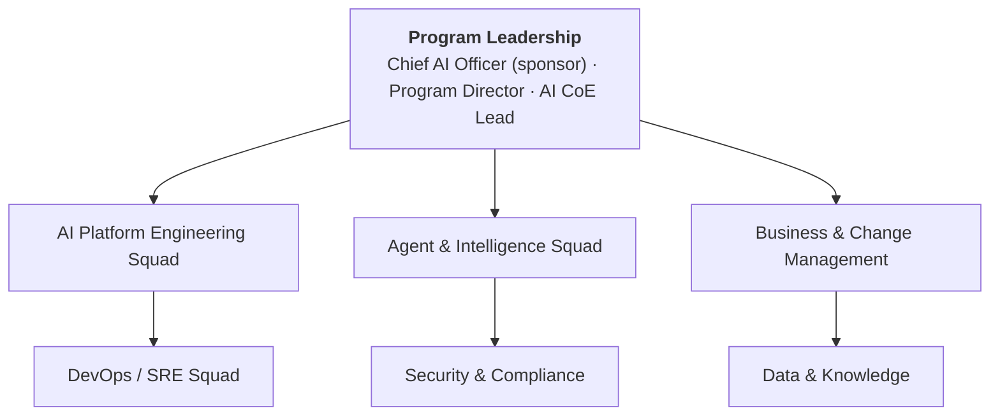

# Resource Plan — AI Evolution & Maturity Platform

## 1. Team Structure

---

## 2. Roles & Responsibilities

| Role | Qty | Type | Responsibility |
|---|---|---|---|
| Program Director | 1 | Internal | Overall program delivery, steering committee chair, risk escalation |
| Chief AI Officer | 1 | Internal | Executive sponsor, AI strategy, AI Review Board chair |
| AI CoE Lead | 1 | Internal | AI governance, model oversight, standards |
| AI Platform Engineer | 4 | Internal | LLM Gateway, RAG, Agent Runtime, Memory, Tool Registry |
| Agent Developer | 3 | Internal | Agent design, system prompts, tool wiring, regression tests |
| DevOps / SRE Engineer | 2 | Internal | K8s, CI/CD, Terraform, monitoring, DR |
| Data Engineer | 2 | Internal | Knowledge ingestion, Vector DB, Data Lake, pipelines |
| Security Engineer | 1 | Internal | PII masking, injection detection, RBAC, audit, compliance |
| Solution Architect | 1 | Internal | Architecture decisions, ADRs, integration design |
| Business Analyst | 2 | Internal | Requirements, user stories, UAT coordination, KPIs |
| Change Manager | 1 | Internal | Training, comms, adoption, stakeholder management |
| SI Partner Delivery Lead | 1 | External | Partner delivery management, quality assurance |
| SI Partner Engineers | 4 | External | Augment platform engineering capacity (Phases 1–6) |
| SI Partner AI Specialists | 2 | External | Agent design, prompt engineering (Phases 1–4) |
| QA Engineer | 2 | Internal/SI | Test automation, AI quality gates, performance testing |

---

## 3. Headcount by Phase

| Role | P1 | P2 | P3 | P4 | P5 | P6 | P7 | P8 | P9 |
|---|---|---|---|---|---|---|---|---|---|
| Program Director | 0.5 | 0.5 | 0.5 | 0.5 | 0.5 | 0.5 | 1.0 | 1.0 | 1.0 |
| AI CoE Lead | 0.25 | 0.25 | 0.5 | 0.5 | 0.5 | 1.0 | 1.0 | 1.0 | 1.0 |
| AI Platform Engineer | 2 | 3 | 4 | 4 | 4 | 4 | 4 | 4 | 4 |
| Agent Developer | 1 | 1 | 2 | 2 | 3 | 3 | 4 | 4 | 4 |
| DevOps / SRE | 1 | 1 | 2 | 2 | 2 | 2 | 2 | 2 | 2 |
| Data Engineer | 0 | 2 | 1 | 1 | 1 | 1 | 2 | 2 | 2 |
| Security Engineer | 0.5 | 0.5 | 1 | 1 | 1 | 1 | 1 | 1 | 1 |
| Solution Architect | 1 | 0.5 | 0.5 | 0.5 | 0.5 | 1 | 1 | 1 | 1 |
| Business Analyst | 1 | 1 | 1 | 1 | 1 | 1 | 2 | 2 | 2 |
| Change Manager | 0.5 | 0.5 | 0.5 | 0.5 | 1 | 1 | 1 | 1 | 1 |
| QA Engineer | 1 | 1 | 1 | 1 | 2 | 2 | 2 | 2 | 2 |
| SI Partner (total) | 4 | 4 | 4 | 3 | 3 | 3 | 2 | 1 | 0 |
| **Total FTE equiv.** | **12.75** | **15.25** | **18** | **17** | **19.5** | **20.5** | **22** | **21** | **20** |

*SI Partner FTE reduces over time as internal capability builds*

---

## 4. Skills Requirements

### 4.1 Core AI Skills (Must Have)

| Skill | Level | Roles Needing It |
|---|---|---|
| LLM API usage (Anthropic / OpenAI) | Advanced | AI Platform, Agent Dev |
| Prompt engineering | Advanced | Agent Dev, AI CoE |
| RAG system design | Advanced | AI Platform, Data Eng |
| Agent framework (LangGraph / LangChain) | Intermediate | AI Platform, Agent Dev |
| Vector database (Pinecone / pgvector) | Intermediate | AI Platform, Data Eng |
| MCP (Model Context Protocol) | Intermediate | AI Platform |
| AI evaluation (RAGAS, LLM-as-judge) | Intermediate | QA, AI CoE |

### 4.2 Platform Skills (Must Have)

| Skill | Level | Roles |
|---|---|---|
| Kubernetes | Advanced | DevOps, SRE |
| Terraform / IaC | Advanced | DevOps |
| Python | Advanced | All engineering |
| TypeScript / Node.js | Intermediate | Platform, Agent Dev |
| Kafka | Intermediate | Platform, Data Eng |
| PostgreSQL | Intermediate | Platform, Data Eng |
| CI/CD (GitHub Actions, ArgoCD) | Advanced | DevOps |

### 4.3 Security Skills

| Skill | Level | Roles |
|---|---|---|
| OAuth 2.0 / OIDC | Advanced | Security, Platform |
| Zero Trust / mTLS | Intermediate | Security, DevOps |
| PII detection / NLP | Intermediate | Security |
| OWASP AI Security | Intermediate | Security, AI CoE |

---

## 5. Training Plan

| Training | Audience | Duration | When |
|---|---|---|---|
| LLM fundamentals & prompt engineering | All engineers | 3 days | Pre-Phase 1 |
| Responsible AI & AI governance | All team | 1 day | Pre-Phase 1 |
| LangGraph agent development | Agent Devs, Platform | 2 days | Pre-Phase 5 |
| AI security (OWASP AI Top 10) | Security, Platform | 1 day | Pre-Phase 3 |
| RAGAS & AI evaluation | QA, AI CoE | 1 day | Pre-Phase 2 |
| Kubernetes advanced | DevOps | 2 days | Pre-Phase 1 |
| AI Act & compliance | AI CoE, Legal | 0.5 days | Pre-Phase 7 |
| AI dashboard usage | Business stakeholders | 0.5 days | Per phase go-live |

---

## 6. RACI Summary (Resource Perspective)

| Activity | Program Director | Solution Architect | AI Platform Eng | Agent Dev | DevOps | Security | Business Analyst |
|---|---|---|---|---|---|---|---|
| Architecture design | C | **A/R** | C | C | C | C | I |
| Agent development | I | C | C | **A/R** | I | C | C |
| Infrastructure build | I | C | C | I | **A/R** | C | I |
| Security controls | I | C | C | C | C | **A/R** | I |
| UAT facilitation | C | I | I | I | I | I | **A/R** |
| Go-live decision | **A** | C | C | C | C | C | C |
| Stakeholder reporting | **A/R** | I | I | I | I | I | C |

---

## 7. Vendor & Partner Requirements

### SI Partner (System Integrator)

**Profile required:**
- Proven AI/GenAI implementation experience (>10 enterprise deployments)
- LangGraph and Anthropic SDK certified/experienced engineers
- Enterprise Kubernetes and DevOps capability
- Managed services capability for post-go-live support

**Engagement model:**
- Phases 1–4: 4 engineers (augment build capacity)
- Phases 5–6: 3 engineers (agent specialisation)
- Phases 7–8: 2 engineers (domain agent development)
- Phase 9: 0 (full internal ownership; SI on retainer only)

**RFP timeline:** 4 weeks (Month 1)

### LLM Provider

- Anthropic: Enterprise Agreement with data processing addendum
- OpenAI: Enterprise API (fallback coverage)
- AWS: Bedrock enterprise agreement (regional data residency option)

### Key SaaS Tools

| Tool | Purpose | License Model |
|---|---|---|
| Pinecone | Vector database | Serverless — pay per read/write |
| Langfuse | AgentOps / LLM observability | Per event |
| GitHub Actions | CI/CD | Per minute |
| ArgoCD | GitOps | Open source |
| HashiCorp Vault | Secrets management | Enterprise licence |
| Datadog | Infrastructure monitoring | Per host |

---

## 8. Headcount Ramp & Cost

| Period | Internal FTE | SI FTE | Blended Monthly Cost |
|---|---|---|---|
| Phase 1–2 (M1–6) | 10 | 4 | $380K |
| Phase 3–4 (M7–12) | 13 | 4 | $500K |
| Phase 5–6 (M13–20) | 16 | 3 | $580K |
| Phase 7 (M21–26) | 18 | 2 | $620K |
| Phase 8 (M27–32) | 18 | 1 | $590K |
| Phase 9 (M33–38) | 18 | 0 | $540K |

*Internal FTE cost basis: $120K/year blended; SI rate: $180/hour blended*
