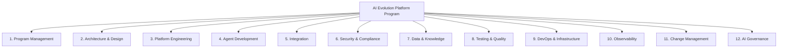

# Scope Definition & Work Breakdown Structure — AI Evolution & Maturity Platform

## 1. Program Scope

### 1.1 In Scope

- Design, build, test, and deploy AI capabilities for Customer Support & Service Operations
- AI platform infrastructure: LLM Gateway, RAG pipeline, Agent runtime, Workflow engine, Tool registry, Memory services
- Integration with CRM (Salesforce), ERP (SAP), Payment Gateway, Logistics API, Identity Provider
- Security controls: PII masking, prompt injection detection, RBAC, audit logging
- Observability: logs, metrics, traces, AgentOps (Langfuse), dashboards, alerting
- DevOps: CI/CD pipelines, Kubernetes deployment, IaC (Terraform), GitOps (ArgoCD)
- Change management: training, documentation, support model handover
- AI governance: model cards, bias audits, policy documentation, AI CoE setup (Phase 7+)
- 9 delivery phases covering Level 1 through Level 10 maturity

### 1.2 Out of Scope

- Re-platforming of CRM, ERP, or payment systems
- AI capabilities outside Customer Support domain (e.g. HR, Finance AI) — Phase 2 program
- Consumer mobile app development (existing app team integrates AI APIs)
- Fine-tuning of foundation models (unless Phase 9 feasibility proves ROI)
- Physical infrastructure; cloud-native only
- Legacy IVR system replacement (separate workstream)

### 1.3 Assumptions

- Cloud platform: Azure (primary) with AWS as secondary
- LLM providers: Anthropic (primary), OpenAI (fallback)
- Existing CRM and ERP systems have documented APIs
- Business SMEs available for knowledge base content review (minimum 20% time)
- IT security team available for security reviews (2 weeks per phase)

---

## 2. Work Breakdown Structure

### WBS Level 1: Program

---

### WBS Level 2–3: Full Breakdown

#### 1. Program Management
- 1.1 Program planning & scheduling
- 1.2 Risk & issue management
- 1.3 Stakeholder reporting (weekly status, monthly steering)
- 1.4 Budget tracking & FinOps
- 1.5 Vendor management (cloud, LLM providers, SI partner)
- 1.6 Phase gate reviews (9 gates)

#### 2. Architecture & Design
- 2.1 Solution architecture (HLD, LLD per phase)
- 2.2 Architecture decision records (ADRs)
- 2.3 NFR definition and acceptance criteria
- 2.4 Integration architecture design
- 2.5 Security architecture review (per phase)
- 2.6 Data architecture design
- 2.7 Architecture governance (review board attendance)

#### 3. Platform Engineering
- 3.1 LLM Gateway — build, configure, test
- 3.2 Prompt Engine — template library, versioning
- 3.3 RAG Pipeline — ingestion, chunking, embedding, retrieval
- 3.4 Agent Runtime — reason-act-observe loop, memory integration
- 3.5 Agent Supervisor — multi-agent routing, delegation
- 3.6 Workflow Engine — LangGraph setup, state management
- 3.7 Memory Service — Redis (short-term), Vector store (long-term)
- 3.8 Function/Tool Registry — MCP server, schema catalogue
- 3.9 API Gateway configuration (Kong / Azure APIM)

#### 4. Agent Development (per agent type)
- 4.1 Customer Service Agent
  - 4.1.1 System prompt design & testing
  - 4.1.2 Tool set definition and wiring
  - 4.1.3 Escalation logic
  - 4.1.4 Regression test suite
- 4.2 Refund Agent
- 4.3 Shipping Agent
- 4.4 Fraud Agent
- 4.5 Knowledge Agent
- 4.6 Supervisor Agent (multi-agent orchestration)

#### 5. Integration
- 5.1 CRM (Salesforce) — read/write API adapters, event streaming
- 5.2 ERP (SAP) — order, inventory, finance API adapters
- 5.3 Payment Gateway — refund, status tools
- 5.4 Logistics APIs — shipment tracking
- 5.5 Identity Provider (Azure AD) — OIDC, JWT validation
- 5.6 Email/notification gateway
- 5.7 Kafka event bus — topics, schemas, connectors
- 5.8 Schema Registry setup

#### 6. Security & Compliance
- 6.1 PII detection and masking pipeline
- 6.2 Prompt injection detection
- 6.3 Output content filtering
- 6.4 RBAC policy configuration (agent roles)
- 6.5 mTLS service mesh setup (Istio)
- 6.6 Secrets management (HashiCorp Vault)
- 6.7 Audit logging pipeline (immutable store)
- 6.8 Penetration test (external; annual)
- 6.9 GDPR controls (erasure API, data residency)
- 6.10 SOC 2 evidence collection

#### 7. Data & Knowledge
- 7.1 Knowledge base content audit and curation
- 7.2 Document ingestion pipelines (Confluence, SharePoint, PDF)
- 7.3 Vector database setup and indexing
- 7.4 Knowledge Graph setup (Neo4j) — Phase 8+
- 7.5 Data Lake setup (S3/ADLS) — partitioning, lifecycle
- 7.6 Data quality monitoring pipeline
- 7.7 PII masking in stored data
- 7.8 Data catalogue setup

#### 8. Testing & Quality
- 8.1 Unit test framework (per service)
- 8.2 Integration test suite
- 8.3 E2E test suite (per user journey)
- 8.4 AI quality gates — prompt regression, RAG eval (RAGAS), agent behaviour
- 8.5 Performance test suite (Locust / k6)
- 8.6 Security test suite (OWASP ZAP, Semgrep)
- 8.7 UAT facilitation (per phase)
- 8.8 Bias evaluation (quarterly)

#### 9. DevOps & Infrastructure
- 9.1 Kubernetes cluster setup (AKS/EKS — dev, staging, prod)
- 9.2 Helm chart library (per service)
- 9.3 Terraform modules (per infra component)
- 9.4 CI/CD pipelines (GitHub Actions)
- 9.5 GitOps setup (ArgoCD)
- 9.6 Container registry and image signing
- 9.7 Autoscaling configuration (HPA per agent type)
- 9.8 Network policies and private endpoints
- 9.9 DR setup — cross-region replication, failover runbooks
- 9.10 Cost management — tagging, dashboards, budget alerts

#### 10. Observability
- 10.1 OpenTelemetry Collector deployment (DaemonSet)
- 10.2 Prometheus + Grafana setup
- 10.3 Distributed tracing (Jaeger / Tempo)
- 10.4 Log aggregation (ELK / OpenSearch)
- 10.5 AgentOps platform (Langfuse)
- 10.6 Alert rules and PagerDuty integration
- 10.7 Executive dashboard build
- 10.8 Operations dashboard build
- 10.9 AI quality dashboard build

#### 11. Change Management
- 11.1 Stakeholder communication plan
- 11.2 Training: agent users (how to work with AI)
- 11.3 Training: developers (AI platform onboarding)
- 11.4 Training: support managers (AI dashboard usage)
- 11.5 User documentation (agent playbooks, escalation guides)
- 11.6 Hypercare support (4 weeks post each phase go-live)

#### 12. AI Governance
- 12.1 AI Governance Policy documentation
- 12.2 Model cards (per model deployed)
- 12.3 AI Review Board setup and cadence
- 12.4 RACI for AI operations
- 12.5 Bias audit process setup
- 12.6 Responsible AI training (all AI engineers)
- 12.7 AI CoE operating model (Phase 9+)
- 12.8 EU AI Act compliance assessment

---

## 3. Phase Gate Criteria

Each phase requires the following before proceeding:

| Gate | Criteria |
|---|---|
| Technical readiness | All services deployed to staging; smoke tests pass |
| Quality readiness | AI quality gates pass (prompt regression > 95%; no safety failures) |
| Security readiness | Security review complete; no critical/high findings |
| Business readiness | UAT signed off by business owner |
| Operational readiness | Runbooks complete; on-call trained; dashboards live |
| Financial approval | Phase budget consumed within 110% |

---

## 4. Deliverables per Phase

| Phase | Key Deliverables |
|---|---|
| 1 (L1–2) | AI chat assistant live; prompt library; LLM Gateway |
| 2 (L3) | RAG pipeline; knowledge base indexed; grounded answers |
| 3 (L4) | Tool registry; CRM/ERP integrations; action-capable AI |
| 4 (L5) | Workflow engine; refund/cancellation workflows automated |
| 5 (L6) | CS Agent live; memory system; autonomous task handling |
| 6 (L7) | All 5 specialist agents; Supervisor; multi-agent orchestration |
| 7 (L8) | Domain agent ecosystems; Knowledge Graph; end-to-end processes |
| 8 (L9) | AI Workforce platform; SLAs; governance dashboards |
| 9 (L10) | Autonomous optimisation loop; AI CoE platform; self-healing |
