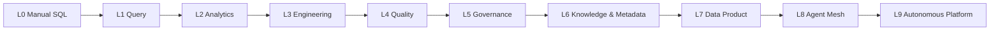
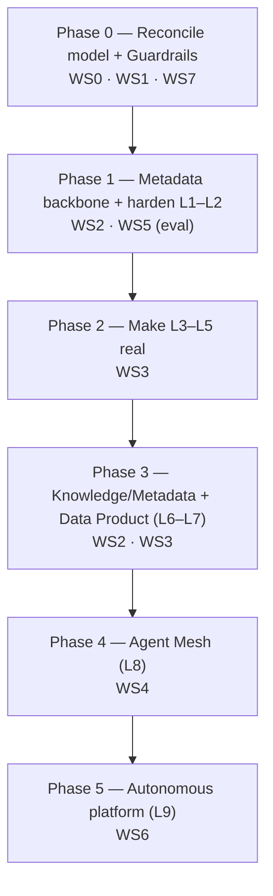

# Data Agents — Gap-Closure Plan

This plan closes the gaps between **[intro-data-agent.md](intro-data-agent.md)** (the vision/taxonomy) and **[implement-data-agent.md](implement-data-agent.md)** (the hands-on build). It reconciles the conflicting maturity models, sequences the unbuilt capabilities, and bakes in the guardrails the intro itself demands.

> **Guiding principle (from the intro):** *Do not start with autonomous multi-agent systems. Start with a deterministic progression.* Every gap below is sequenced so that trust, security, and metadata come **before** autonomy.

---

## 1. Gap Summary

| # | Gap | Severity | Workstream |
|---|---|---|---|
| G1 | Four incompatible maturity ladders (9-level taxonomy vs 6-level model vs 7-level vs 9-level) | 🔴 Blocker | WS0 |
| G2 | 4 of 9 agent types defined but never implemented (Metadata, Steward, Product, Autonomous) | 🔴 High | WS3 |
| G3 | Agent Mesh, Data Fabric, Semantic/Lineage layers described but not built | 🟠 High | WS2, WS4 |
| G4 | None of the intro's "10 Enterprise Gaps" are addressed in code | 🔴 High | WS1, WS5, WS6 |
| G5 | Implementation contradicts intro principles (hardcoded metadata, static planner, raw SQL execution) | 🔴 High | WS1, WS2 |
| G6 | Reference-architecture & technology mismatches (agents-vs-tools, LangChain vs LangGraph) | 🟡 Medium | WS0 |
| G7 | Housekeeping (empty `New Text Document.txt`, missing prompt files, no setup/eval) | 🟢 Low | WS7 |

---

## 2. WS0 — Reconcile the Maturity Model (closes G1, G6)

Replace all four ladders with **one canonical L0–L9 model**. Each level is additive and must not regress the controls of the level below.

| New | Level Name | Maturity Label | Absorbs (old) |
|---|---|---|---|
| **L0** | Traditional / Manual SQL | Deterministic | Intro MM L0 |
| **L1** | Query Agent (NL → SQL) | Reactive | Taxonomy L1 |
| **L2** | Analytics Agent (forecasting, RCA, segmentation) | Analytical | Taxonomy L2 |
| **L3** | Data Engineering Agent (ingestion, pipelines, transforms) | Constructive | Taxonomy L3 |
| **L4** | Data Quality Agent (detect → investigate → fix → validate) | Self-checking | Taxonomy L4 |
| **L5** | Governance Agent (PII, classification, lineage, policy, retention) | Governed | Taxonomy L5 |
| **L6** | Knowledge & Metadata Agent (catalog, semantic layer, stewardship, glossary) | Context-aware | Taxonomy L6 **+** L7 (Steward merged) |
| **L7** | Data Product Agent (publish, version, monitor, Data Mesh) | Product-oriented | Taxonomy L8 |
| **L8** | Multi-Agent Mesh (concierge, routing, delegation, collaboration) | Collaborative | Intro "Mesh" + Implement L6 |
| **L9** | Autonomous / Self-Driving Data Platform (cost, capacity, self-heal/govern/optimize) | Autonomous | Taxonomy L9 + Implement L7–L9 |

**Action:** update `intro-data-agent.md` and `implement-data-agent.md` to reference *only* this table; delete the three superseded ladders. Resolve the **agent-vs-tool** wording (specialized agents own reasoning + a tool belt; tools are deterministic capabilities the agents call) and pick one framework — **LangGraph** (stateful graphs, HITL interrupts) — retiring the LangChain/LlamaIndex references or noting them as embedding/RAG utilities only.

---

## 3. WS1 — Foundations & Guardrails (closes G4, G5)

These are **prerequisites for every level above L1** and directly close the intro's *Security*, *Deterministic Execution*, and *Trust* gaps. None of this exists in the current implementation.

| Control | Current state | Target |
|---|---|---|
| SQL safety | Raw LLM SQL executed directly | Parse + validate; **read-only** enforced; reject DDL/DML; row & cost limits; parameterised where possible |
| AuthZ / data access | None | Per-agent service identity; RBAC + row/column-level security; queries run as the *requesting* user's grants, not a superuser |
| Human-in-the-loop | None | Approval gate for writes, schema changes, masking changes, and any action above a risk threshold |
| Determinism | Planner is a hardcoded list | Plan is generated but **every tool call is validated** against a schema before execution; dry-run mode |
| Explainability | None | Every answer returns: SQL used, tables/columns touched, row count, and a natural-language rationale + caveats |
| Secrets / config | Inlined connection string | Externalised secrets (Vault/env), no credentials in code or prompts |
| Audit | None | Immutable log of question → plan → tools → SQL → result, per session |

---

## 4. WS2 — Metadata & Semantic Backbone (closes G3, G5)

The intro calls metadata *"the most important component"* and *"without metadata, Agent = Blind"* — yet the implementation hardcodes it. Build the real backbone before scaling agents.

- Replace the hardcoded `MetadataTool` with a live catalog integration (**DataHub / OpenMetadata**): tables, columns, owners, descriptions, popularity.
- Stand up the **Knowledge Graph** (Neo4j / Neptune) with entities + relationships, and implement the referenced-but-missing **`LineageTool`** (column-level lineage).
- Add the **Semantic Layer** (business glossary, KPI definitions, metric → physical-column mappings) so agents resolve "revenue", "churn", "active customer" deterministically.
- Implement `memory.py` (currently a stub): short-term session memory + long-term entity/preference memory.

> Closes the *Semantic Understanding*, *Metadata Quality*, *Lineage*, and *Cross-System Context* enterprise gaps.

---

## 5. WS3 — Build the Missing Agents (closes G2)

Bring each unbuilt agent from "named in a diagram" to a defined, testable capability.

| Agent | Gap today | Minimum buildout |
|---|---|---|
| L2 Analytics | `describe()` only | Real forecasting, root-cause, segmentation; narrative explanation |
| L3 Engineering | YAML example only | Source discovery → mapping → pipeline (dbt/Airflow) generation → test → deploy, behind HITL |
| L4 Quality | One GE assertion (detect) | Full **Detect → Investigate → Fix → Validate** loop with Great Expectations + remediation actions |
| L5 Governance | `if contains_pii` pseudocode | Classification, masking, retention, policy enforcement, lineage-aware impact analysis |
| **L6 Metadata/Steward** | Not implemented | Cataloging, discovery, semantic relationships, glossary, KPI defs, ownership (built on WS2) |
| **L7 Data Product** | Name only | Design → publish → version → monitor → retire; Data Mesh contract + SLOs |
| **L8 Concierge/Mesh** | Static "Coordinator" box | See WS4 |
| **L9 Autonomous Platform** | Absent | See WS6 |

---

## 6. WS4 — Agent Mesh & Coordination (closes G3)

The intro promises a *"service mesh for agents with reasoning and planning"*; the implementation has only a static coordinator.

- **Data Concierge / Supervisor agent**: intent classification → routing → delegation → result composition.
- **Coordination protocol**: agent registry/discovery, message contracts, max delegation depth, per-agent timeouts, deadlock prevention.
- **Shared context**: correlation/trace IDs across agents; conflict reconciliation before responding.

> Closes the *Agent Coordination* enterprise gap.

---

## 7. WS5 — Trust, Explainability & Evaluation (closes G4)

- Grounded narrative answers with **source citations** (tables, columns, lineage) and explicit assumptions.
- **Evaluation harness**: SQL correctness vs gold queries, hallucination checks, answer-faithfulness, and regression tests per agent (none exist today).
- Confidence scoring + automatic escalation to a human when low.

> Closes the *Trust & Explainability* enterprise gap and makes the intro's flagship example ("explain anomalies") real.

---

## 8. WS6 — Cost & Platform Autonomy (closes G2, G4)

Only safe to enable after WS1–WS5 are solid.

- FinOps guardrails: per-query/-session/-tenant cost budgets; warehouse auto-suspend; query cost prediction.
- Autonomous platform behaviours (L9): tiering cold data, capacity planning, workload balancing, self-healing pipelines — each gated by policy-as-code and a human-accountable review board.

> Closes the *Cost Control* enterprise gap.

---

## 9. WS7 — Housekeeping (closes G7)

- Delete the empty `New Text Document.txt`.
- Provide the referenced `prompts/sql_generation.txt` (don't inline it), add `requirements.txt`, and a setup/run section.
- Add error handling, retries, and wire observability (Monte Carlo / OpenTelemetry) — currently listed in the stack table but unused.

---

## 10. Phased Roadmap

| Phase | Exit criteria (Definition of Done) |
|---|---|
| **0** | One canonical ladder in both docs; SQL is read-only + validated; HITL on writes; secrets externalised; audit log live |
| **1** | Metadata from DataHub (no hardcoding); lineage + semantic layer queryable; L1/L2 answers carry citations + pass eval harness |
| **2** | L3 generates tested pipelines behind approval; L4 closes detect→fix→validate; L5 enforces classification/masking/retention |
| **3** | L6 catalog + glossary + KPI defs operational; L7 publishes versioned data products with SLOs |
| **4** | Concierge routes to specialists with discovery, delegation limits, and conflict reconciliation; cross-agent tracing |
| **5** | Cost budgets enforced; autonomous actions gated by policy-as-code + review board; self-healing demonstrated |

---

## 11. Enterprise-Gap → Closure Map

The intro's 10 adoption blockers, mapped to where they get fixed:

| Enterprise Gap (intro) | Closed in |
|---|---|
| Semantic Understanding | WS2 (semantic layer) |
| Metadata Quality | WS2 (DataHub/OpenMetadata) |
| Data Lineage | WS2 (`LineageTool`, KG) |
| Governance Automation | WS3 (L5), WS6 (policy-as-code) |
| Trust & Explainability | WS5 |
| Cross-System Context | WS2 (KG), WS4 (shared context) |
| Deterministic Execution | WS1 (validation, dry-run, HITL) |
| Agent Coordination | WS4 (mesh + protocol) |
| Cost Control | WS6 (FinOps guardrails) |
| Enterprise Security | WS1 (RBAC, RLS, read-only, secrets) |

---

## 12. Quick Wins (do first, low effort / high signal)

1. Delete `New Text Document.txt`.
2. Adopt the **single L0–L9 ladder** (Section 2) across both docs.
3. Make `QueryTool` **read-only** and reject non-`SELECT` statements — one guardrail that removes the worst risk.
4. Return the **generated SQL + row count + rationale** with every answer (cheap explainability).
5. Externalise the connection string and add `requirements.txt` + a run section.

---

*Author: Vijayagopalan Raveendran · © 2026. Companion to [intro-data-agent.md](intro-data-agent.md) and [implement-data-agent.md](implement-data-agent.md).*
